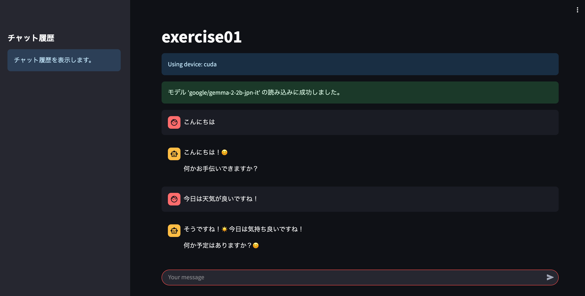

# Day1 -exercise
## 対話形式のUIに変更
- run.ipynbを上から順に実行で起動(.envは手動で配置)
- [Open Colab Notebook](https://colab.research.google.com/github/Hiragi14/lecture-ai-engineering/blob/master/day1/exercise01/run.ipynb)

